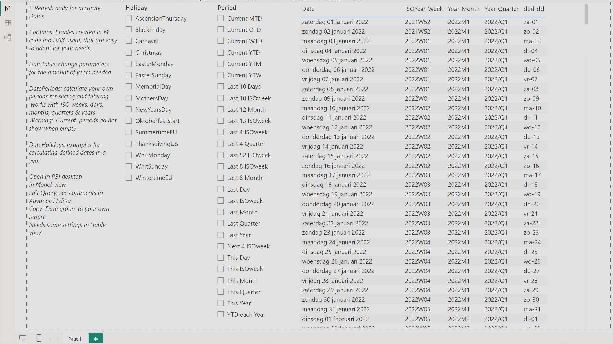

# SpecialDate
Date table, Period table &amp; Holiday table calculations for Power BI in Power Query M-code

Read comment in the 3 txt files. Paste the code in your Power BI report. Easy to customize for you own periods and special dates. The DateTable must be at least 3 years [current +- 1], but can be used with all you sales and forecast data. The DatePeriods includes the ISO 8601 weeknumbers used in European business planning, this is not standard available in the current slicer. Periods can be years, quarters, months, ISOweeks or days. The DateHolidays creates a tabel with western christian easter related dates, and different kind of event days with definitions that are easy to reuse.

